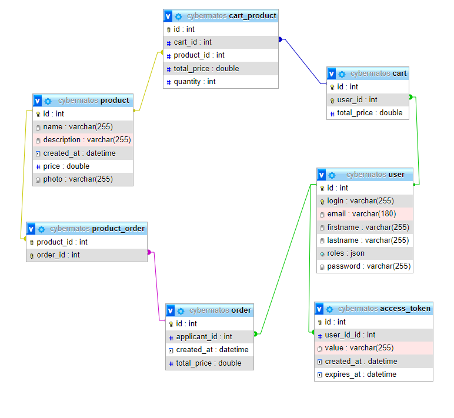
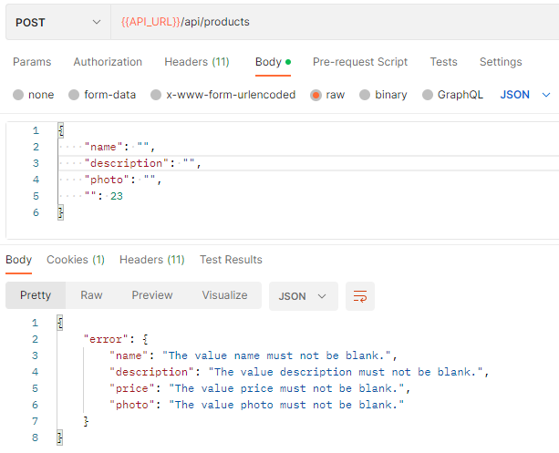

# CyberMatos Docs

## Entity Relationship Diagrams



### Api routes

Exemples of API routes with JSON content type

Retrieve a specific product or the list of products

✔️ **/api/products/{productId}**  
✔️ **/api/products**

```
{
"id": 1 ,
"name": "Item 3000" ,
"description": "Best item in the shop !" ,
"photo": "image.png" ,
"price": 13.37
}
```

Register a new user

✔️ **/api/register**

```
{
" login ": " foobar " ,
" password ": " mypassword " ,
" email ": " my@email . com " ,
" firstname ": " Foo " ,
" lastname ": " Bar "
}
```

### Errors

For errors, API return a json like this :

```
{
"error": "The error message explaining what went wrong."
}
```

When there are multiple errors, the API returns a list :


